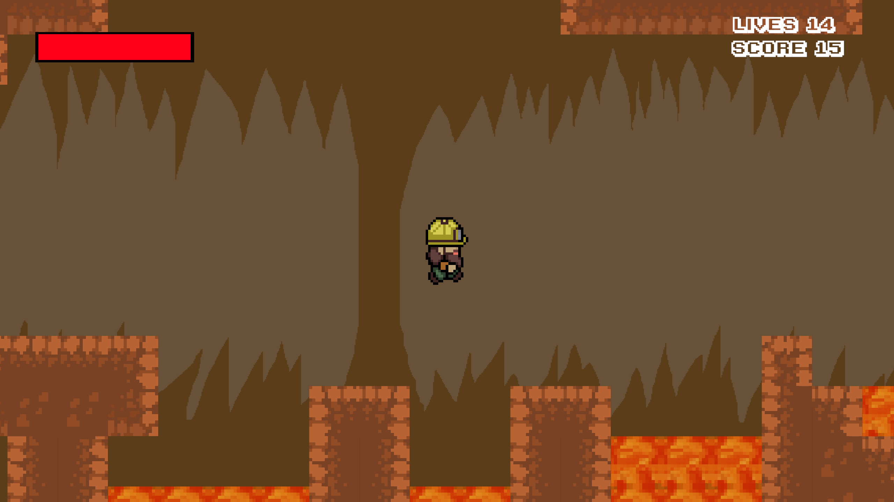
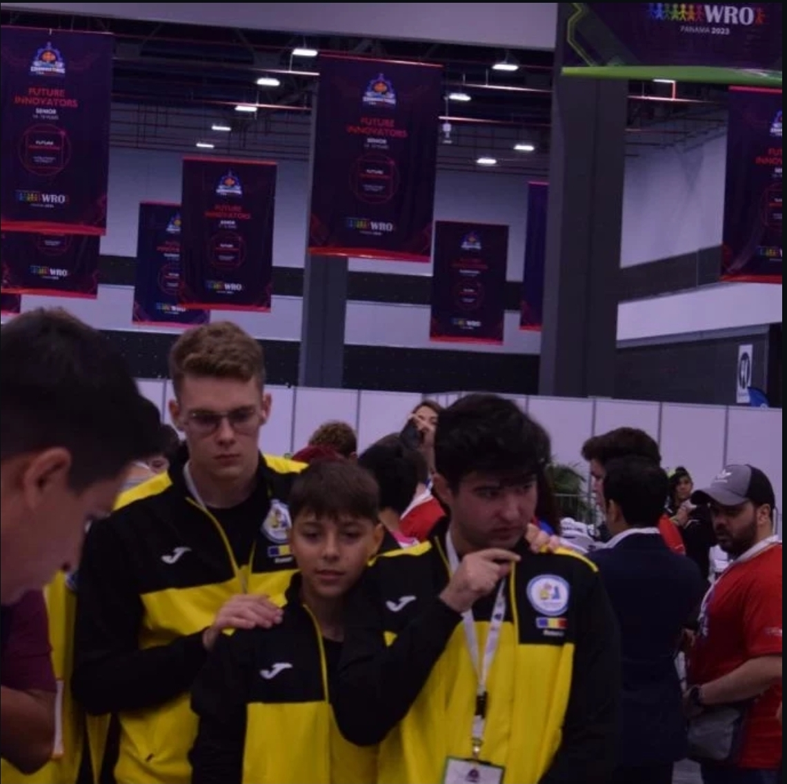
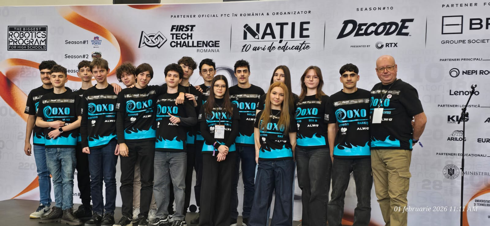

# About.Me
So, a quick overview of my passions! I program (C / C++ / C# / Python), I do robotics (programming and 3D designing), I have made games in Unity (worked by myself and in a small team), and I'm also into cybersecurity (currently working on getting the CBBH and the CPTS).

Now more on each one!

Competitive Programming

I have been programming in C/C++ since 5th grade. Every year, I have participated in the Roalgo Olympiad and qualified for the national phase. In total, I have two silver medals. In 8th grade, I also made it into the large national lot (top 20 students from 5th–8th grade).

Even though this is what got me into IT, I still have mixed feelings about it.

On one hand, this is where I develop my rational thinking and learn time-efficient algorithms.

On the other, the competition rewards fast-written programs with little focus on scalability, often trading good structure for writing speed.

I would have liked a competition where code is also evaluated based on readability and good coding practices, where tight deadlines wouldn’t push solutions towards 500 lines written in main.

Of course, I still respect the contest and the students who practice every day to reach the top.

## Video Games
In summer breaks, I would usually start working on a passion project (mostly games). I have made a total of 5 Unity games and several ASCII C++ games (two of which I'm very proud of and will talk about later). Now for the Unity games:

The first one I made alone, and it was a simple X/O game (it was a good way to familiarize myself with the Unity game engine and C#).

The second one was a cool Flappy Bird clone I made with two other friends (actually learned a lot about working as a team and using GitHub to sync our project).

For the third one, I wanted to make my dream game. I got really ambitious and thought of making a 2D bullet hell where you play as a submarine and try to progress to the deepest part of the ocean. The thing is, the fish kind of got fed up with all the stuff humans have been doing to the ocean, so they will attack. I put a demo version on Itch.io and Newgrounds (I still want to continue working on it because it has a lot of potential and it still is my dream game).

Newgrounds: https://www.newgrounds.com/portal/view/892073
Itch.io: https://lildevthatstrynagobig.itch.io/s

I made the fourth game with the same two friends I made the second one with. With this one, we won the game jam competition from our summer camp. It was a 2D platformer with a lot of cool mechanics. You are a miner trying to get rich by collecting the gems found deep inside a cave. There are, of course, a lot of things trying to stop you. After the game jam, we kept working on the game for a while. We all think it has a lot of potential and that one day we could publish it on Steam. We also all have school, so it's hard to go all in with the development :(

Game Build: https://github.com/RaduSefuLaGithub/UnderGrundle-Build

The fifth game was also born during the same game jam as the fourth (a year later, that is). I made it along with one of the two friends I worked with in the past and a newcomer. This one was an Overcooked-inspired party game. You and your friends need to take care of some mutant plants. They need to be fed potions that y'all have to collect and brew. If not fed in time, they won’t act pretty...

## Robotics

I was part of a private robotics club from 7th to 10th grade, competing in the World Robot Olympiad (WRO). During this time, I worked on robot programming and 3D design.

I would commute from Călărași to Bucharest (taking the 16:30–19:00 train on Friday and the 20:30–22:30 train back home on Sundays). I slept at my brother’s apartment.
I worked at the club from 10:00–19:00 on Saturdays and Sundays.
I also went there during school breaks (full 5-day weeks back to back).

I did all of this because it really didn’t feel like work to me. I enjoyed the train trips, listening to music during night rides, and using public transport. Being at the club was also really fun. I had lots of friends there, whom I still talk to to this day.

Year 1 – RoboSports

Team of two (me and Cezar). We placed 2nd nationally. Cezar couldn’t go to the international (for personal reasons), so I spoke with the first-place team and asked if I could join.
Now in a team of three (the other two are named Alex and Luca), we achieved 4th place globally at the international in Panama.

Year 2 – Future Engineers

Switched to the more advanced Future Engineers category, which involves full documentation and more complex systems.
Once again, I’m back with Cezar. Cezar was in 12th grade this year, so he backed out before nationals.
I continued the project independently and placed 2nd nationally.
Teamed up with Andrei for the international round in Brescia, where we earned 2nd place internationally.

Year 3 – RoboSports

Returned to RoboSports, now in a team of three (alongside Edi and Radu). We finally got 1st place nationally.
I couldn’t attend the international competition in Singapore, but my team placed 17th globally (without my help after nationals, so I won’t take credit).

Currently I’m Co-Leader of my high school FTC team. Here’s a photo of us at the regional.

## Cyber Security

My first run-in with cybersecurity was in 9th grade when I took the Romanian Cyber Security Olympiad (OSCJ25) with 0 knowledge. I got 351st place out of 747 participants. Not really anything impressive, but it did leave an impression on me. I had fun. During a 6-hour contest, time passed like nothing. It was actually amazing.

I got sucked into another universe. People here talked about red teaming, penetration testing, and bug bounty, and it was all so cool.
And so the training arc started. Every weekend, I would join a CTF from CTFtime and just go with it. I would get my ass kicked, but I really didn’t care because it was fun.

During this time, some noteworthy competition placements are:
FiiCode 2025 – I got through the first phase and was invited to Iași for the national stage. It was a team of 3, but I went alone since, at the time, I had no friends in the area. I got 10th place during my first 30-hour competition. Pepsi saved me here since I didn’t like coffee.
YouniHack 2025 – Along with 4 other friends, we formed the team HashCrackers (even though, in the end, we did not have any hashes to crack. sad story) and got 4th place. It was a long 30-hour competition, and I had to survive off Bitch Please Caramel Latte, which they handed out there from the sponsors.

After a while, I went all in. I had a goal: get the HTB CBBH certificate before I turned 17. Tight deadline, but I thought that a 16-year-old with a bug bounty cert sounded so cool. I would be the best.
Every day for a month, I’d spend 4 hours reading the training (in school, during breaks, or at home), and after that, when I got home, another 2 hours completing the labs.

After 100% completing the role path, I could buy the cert and take the exam. I did. It went badly...
I needed 8 flags, but I only got 4. It was a 7-day exam in which, in the first 5 days, you had to find the flags, and in the last 2 days, prepare a write-up on how you got everything.
After two days, I felt so bad I couldn’t open my VM and go to the site. It felt painful. I overestimated myself and just spent my yearly income on a certification I couldn’t complete. There is no happy ending to this.

I lost myself after that and stopped learning cybersecurity.

2 weeks ago, I went to OSCJ26. I tried to derust a day prior and got 58th place out of 657 participants in all of high school (since the challenges are the same for all classes 9–12). I will be going to the national phase on 15–17 May. I’m trying to recover from my losses and be better.
